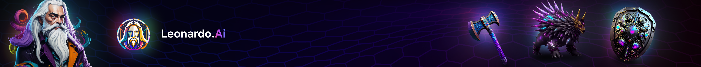
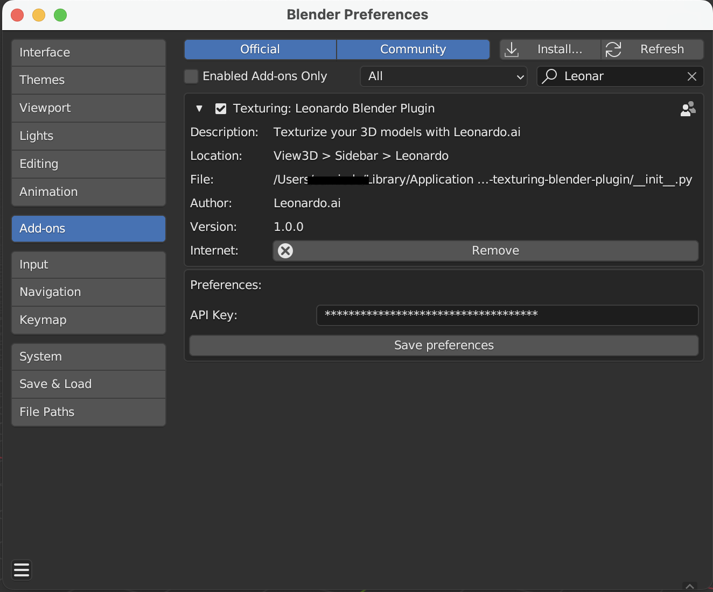
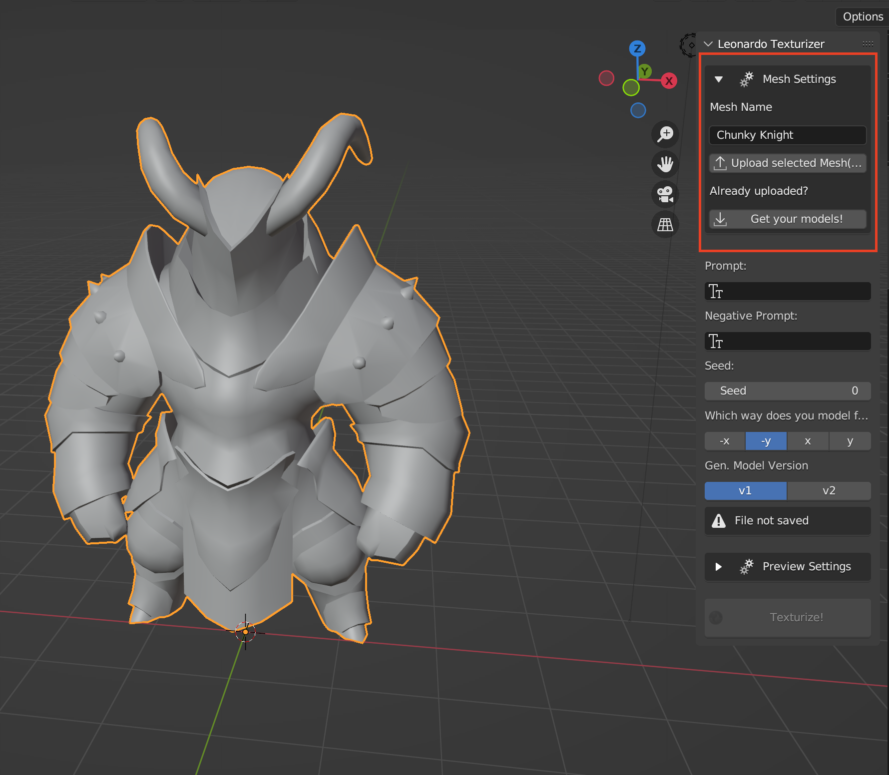
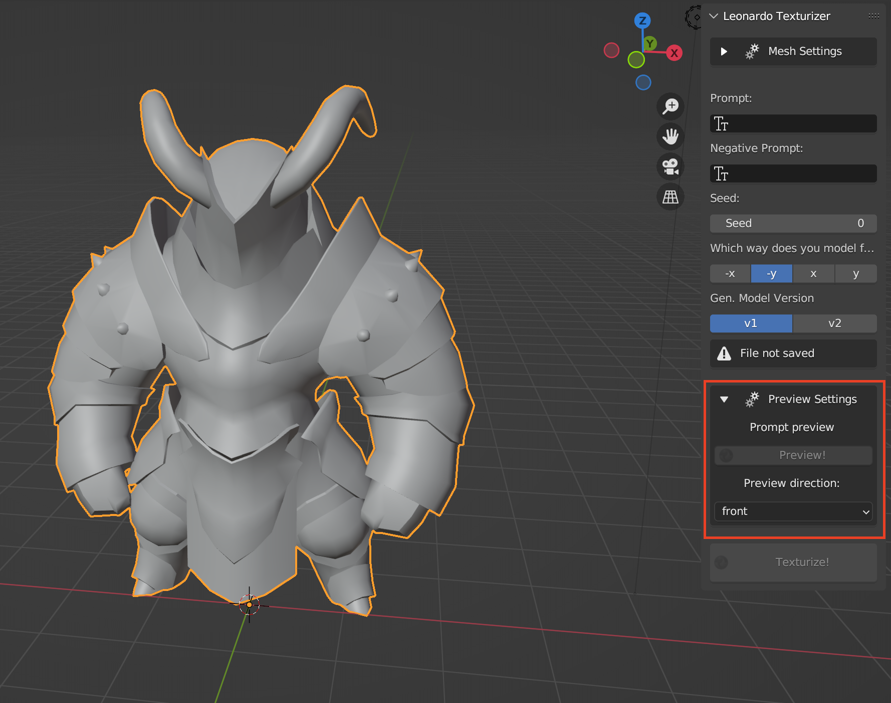
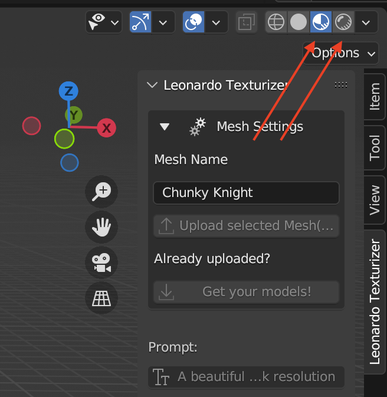
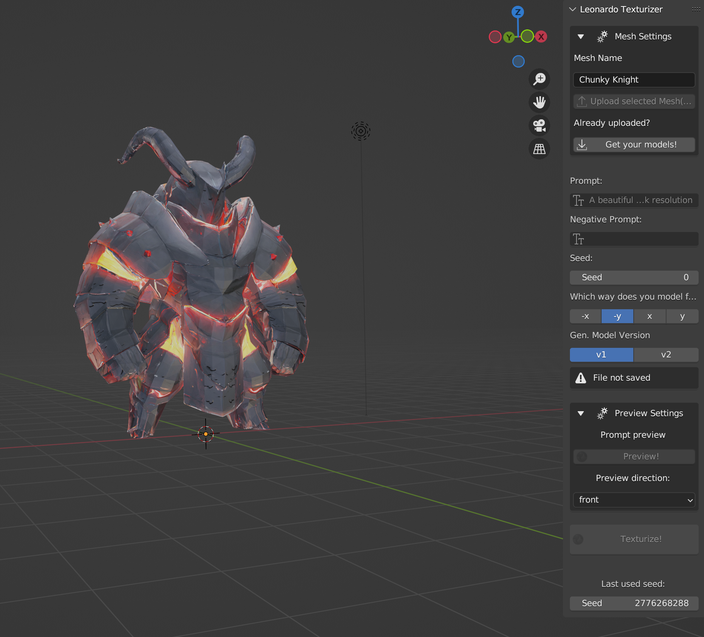

 

# Leonardo Blender Addon

The Leonardo Blender Plugin allows you to texture any existing 3D model right from within Blender!

## How to Install

>Tested in Blender > 3.4

To use the Leonardo Blender Plugin, you need to install it as an add-on in Blender. Follow these steps:

1. Download the [latest release](https://github.com/Leonardo-Interactive/leonardo-texturing-blender-plugin/releases/latest)
2. Open Blender and go to **Edit > Preferences**.
3. In the Preferences window, click on the **Add-ons** tab.
4. Click on the **Install** button at the top of the window.
5. In the file dialog that appears, navigate to the location where you have saved the plugin code, select the relevant Python script file, and click on **Install Add-on**.
6. Once the add-on is installed, you should see it appear in the Add-ons list in the Preferences window. Make sure it is enabled by checking the box next to its name.
7. Enter your API key in the preference window. You can obtain your API key from the Leonardo website in your user account. **Note**: You need a paid account to be eligible for an API key!

8. Close the Preferences window, and the add-on should be ready to use in Blender.

## Usage Instructions

Once you have installed the Leonardo Blender Plugin, follow these instructions to generate textures for your 3D models:

1. Before generating a texture, you need to upload a mesh from the **Mesh Settings** section. If you have previously uploaded a mesh, you can find a list of your meshes in the same section. Select the one you want to work with.

2. To preview the texture from one side of the model, explore the options in the **Preview** section. This will only generate a texture from one direction (that you can choose), which will be faster and cost less tokens so you can experiment with your prompt.

3. To generate a texture or a preview, follow these steps:
   - Select an uploaded mesh.
   - Enter a prompt and an optional negative prompt.
   - Press the "Texturize!" or "Preview!" button.
4. The algorithm requires knowledge of the front of the mesh, so make sure you **align your mesh** with one of the principal axes and select it in the settings.
5. To make sure to see the texture once it finishes generated, enable either `Material Preview` or `Rendered Preview` in the viewport shading settings!

With these instructions, you can now seamlessly create stunning textures for your 3D models using the Leonardo Blender Plugin!

## Advanced

1. You have control of the seed in the `Seed` input. This can also be useful if you found a texture that you like but you want to make small changes to the prompt.
2. We provide two models (`v1` and `v2`) that both differ in their style, so make sure you try both!

Model by [thanhtp](https://sketchfab.com/3d-models/chunky-knight-f1722ab650ad4d8dbe6fc4bf44e33d38) on Sketchfab.
